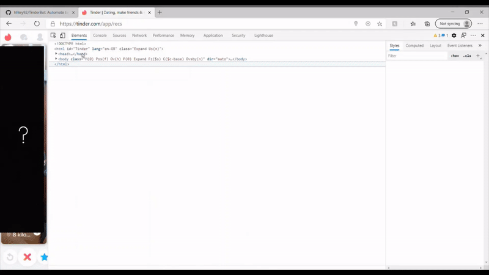

# TinderBot

You can easily automate your tinder likes using your own credentials. To read the full tutorial of how to get your request headers (credentials) kindly check my [article on Medium](https://medium.com/@hfikry/automate-likes-on-tinder-in-10-minutes-using-python-c16b42164dc6)

# Why?
Why not? But I would highly advise you to use it for educational and curiosity reasons. You are smart.


### Installation

Installing package:

```sh
pip install TinderBot 
```

Installing package through Google Colab, Kaggle or other cloud notebooks that allow package installations

```sh
!pip install TinderBot 
```

## Before you start
- Login on Tinder in your browser
- Get your request headers key-value pairs
- Paste them in a text file


### Usage   


| Function | Parameters | Description |
| ------ | ------ | ------ |
| Constructor function | headersPath (String)| a text file path that contains the headers dictionary that is copied from the browser |
| likeNext | - | - |
|likeMany | maxLikes (optional integer)| The maximum number of automated likes |
| |  sleep (optional float) | The default value is 0.5, which is in seconds. It defines sleep time between likes [CANNOT BE LESS THAN 0.5 (SECONDS) or your account will be blocked on Tinder] |
| |  printProgress (optional boolan) | The default is True. it simply shows/hides the progress print |
|likeAll |  sleep (optional float) | The default value is 0.5, which is in seconds. It defines sleep time between likes [CANNOT BE LESS THAN 0.5 (SECONDS) or your account will be blocked on Tinder] |
| |  printProgress (optional boolan) | The default is True. it simply shows/hides the progress print |


### Example

```python
from TinderBot import TinderBot

#constructor
bot = TinderBot("headers_textfile.txt")

#automation
bot.likeAll()
#OR
bot.likeMany(maxLikes = 10, sleep = 1)
```


License
----

**Free Software, Hell Yeeahh**


